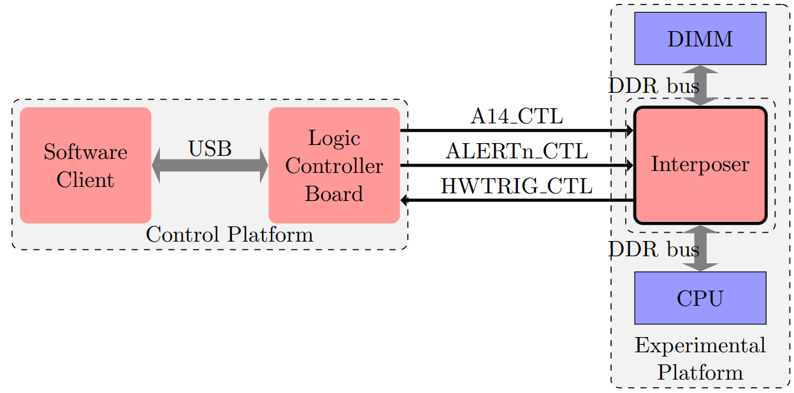
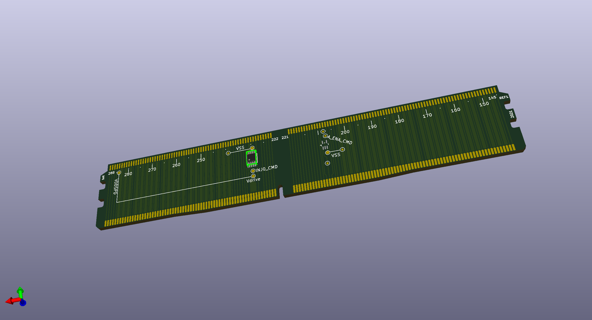
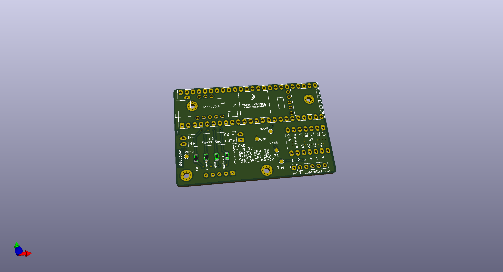

# Intro

This is the hardware description of the mFIT's interposer and the controller board.

There are two [KiCAD](https://www.kicad.org/) projects:

1. the [interposer](./interposer/) that is inserted in the DIMM connector,
1. the [logic controller board](./control-board/) that manipulates the signals on the interposer.

*Note*: The interposer schematic and PCB does not capture the ``HWTRIG_CTL`` signal.
The signal can be read via the additional interposer, by simply
soldering a wire on the ``SDA`` signal.
The ``SDA`` signal is on Pin 285 on a DDR4 RDIMM.

## High-level diagram

## The interposer

## The logic controller board

# Notes on fabrication

The [out](../binary/) folder contains already the gerbers for the interposer.

## The pricing is reasonable

Both boards are double sided and with components on a single side.
The interposer uses two edge connectors, one in which the DIMM is inserted and
one printed on the PCB (gold-fingers).
The interposer has no drill holes.

## Choosing the right PCB finish

While the typical edge connector of a DIMM is gold plated, a low cost option is
to use the silver finish.
Due to its relative flatness, a silver finish makes soldering the edge
female connector easy.

## Use an additional interposer
An additional interposer is required to protect the motherboard.

Typically, cost affordable PCBs are 1.6mm or 1.2mm in thickness.
This makes the edge male connector of the interposer unsuitable for the DIMM
socket on the motherboard.
The DIMM socket expects a 1.4mm thick gold-finger connector.
However, we obtained good results with a PCB of 1.6mm thick and an additional
[DDR4 DIMM extender](https://mfactors.com/jet-5601ah-ddr4-288-extender/).

# Bill of Materials (BOM)

## The interposer
 1. RF switch for the A14 signal, [ADG902](https://www.analog.com/en/products/adg902.html)
 1. digital switch for the ALERTn signal, [SN74AUC1G66](https://www.ti.com/product/SN74AUC1G66)
 1. DDR4 288-Pin, Straddle Mount, 1.2V, [CONN-DDR4-288-SM](http://www.adexelec.com/connectors)

## The controller board
 1. An MCU, [Teensy 3.6](https://www.pjrc.com/store/teensy36.html)
 1. A buffer/level shifter for I/O, based on [TXB0104](https://www.sparkfun.com/products/11771)
 1. Voltage regulator providing 1.2V, based on [AMS1117](http://www.advanced-monolithic.com/pdf/ds1117.pdf)
 1. LEDs, current limiting resistors

## The additional interposer

 1. A [DDR4 DIMM extender](https://mfactors.com/jet-5601ah-ddr4-288-extender/).
